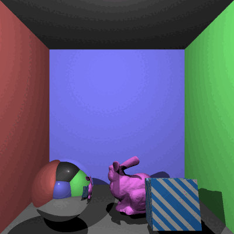
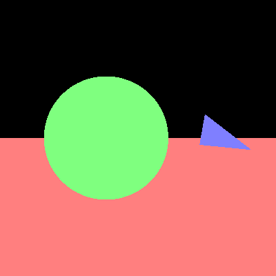
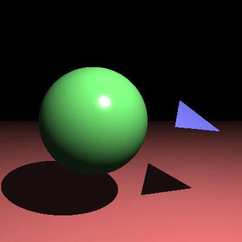
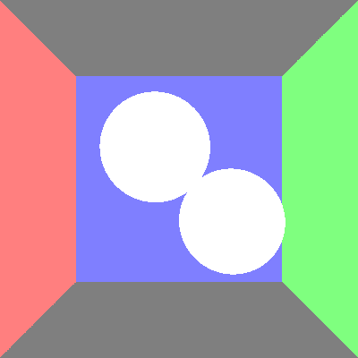
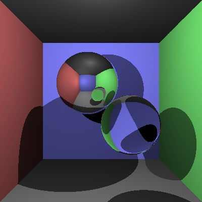

# C# Ray Tracer · 光线追踪渲染器

A physically-based **ray tracer** written from scratch in C# (.NET 9). It implements the
Whitted illumination model with recursive reflection & refraction, hard/soft shadows,
anti-aliasing, depth-of-field, texture & normal mapping, procedural materials, triangle-mesh
(`.obj`) loading, and a keyframe animation system that exports to GIF.

> 一个用 C#（.NET 9）从零实现的**物理光线追踪渲染器**：完整的 Whitted 光照模型、递归反射与折射、
> 阴影、抗锯齿、景深、纹理与法线贴图、程序化材质、三角网格（`.obj`）加载，以及可导出 GIF 的关键帧动画系统。



---

## ✨ Features · 功能亮点

| | Feature | 说明 |
|---|---|---|
| 🎥 | **Whitted illumination model** | 递归反射 + 折射（Snell + Fresnel）、镜面/漫反射、环境光 |
| 🌑 | **Shadows** | 阴影光线，支持硬阴影 |
| 🔺 | **Primitives & meshes** | 球体、平面、三角形，以及 `.obj` 三角网格模型加载 |
| 🪞 | **Anti-aliasing** | 超采样抗锯齿（可调采样倍率 `-x`） |
| 📷 | **Depth of field** | 基于光圈半径 / 焦距的景深虚化（`-r` / `-t`） |
| 🖼️ | **Texture & normal mapping** | UV 颜色贴图 + 法线贴图 |
| 🌀 | **Procedural materials** | 程序化纹理（如棋盘格等图案，无需贴图文件） |
| 🎞️ | **Animation** | 简单动画 + 关键帧插值动画 + 相机动画，多帧渲染自动合成 GIF |

> 内部从零实现了向量 / 四元数 / 变换数学库（`src/math`），未依赖现成的图形数学库。

---

## 🚀 Getting Started · 快速开始

**Requirements / 环境：** [.NET 9 SDK](https://dotnet.microsoft.com/download)

```bash
# Build / 构建
dotnet build

# Render a sample scene / 渲染一个示例场景
dotnet run -- -f tests/sample_scene_1.txt -o output.png
```

### Command-line options · 命令行参数

| Flag | Description | 说明 |
|------|-------------|------|
| `-f` | Input scene file (`.txt`) | 输入场景文件 |
| `-o` | Output image path (PNG/GIF) | 输出图像路径 |
| `-w` / `-h` | Output width / height | 输出宽 / 高（像素） |
| `-x` | Anti-aliasing multiplier | 抗锯齿采样倍率 |
| `-r` / `-t` | Aperture radius / focal length (DOF) | 光圈半径 / 焦距（景深） |
| `-m` / `-s` | Frame count / FPS (animation) | 帧数 / 帧率（动画） |
| `-l` | Enable ambient lighting | 开启环境光 |

---

## 🖼️ Sample Renders · 示例渲染

| Diffuse shading | Reflection / refraction |
|---|---|
|  |  |
|  |  |

The animated render at the top was produced with:

```bash
dotnet run -- -f tests/final_scene.txt -o final_scene.png -m 30 -s 5 -q 0 -x 2
```

---

## 🏗️ Architecture · 项目结构

```
src/
├── math/        Vector3, Quaternion, Ray, Transform, RayHit   ← 自实现数学库
├── core/        Color, Image, Material                        ← 颜色与图像 I/O
├── scene/       Scene, Camera, lights, SceneReader (parser)   ← 场景与渲染管线
│   └── primitives/   Sphere, Plane, Triangle
└── extensions/  ObjModel, TextureMaterial, ProceduralMaterial,
                 SimpleAnimation, KeyFrameAnimation            ← 进阶特性
```

The renderer parses a plain-text scene description (`tests/*.txt`), builds the scene graph,
then casts a ray per pixel and recursively traces reflection/refraction bounces until a depth
limit is reached.

> 渲染器解析纯文本场景描述文件，构建场景图，为每个像素投射光线，并递归追踪反射 / 折射，直到达到深度上限。

---

## 🛠️ Tech Stack · 技术栈

- **Language:** C# / .NET 9
- **Libraries:** [Magick.NET](https://github.com/dlemstra/Magick.NET) (GIF assembly),
  StbImageSharp (texture loading), CommandLineParser
- **Concepts:** ray–surface intersection, Whitted recursive ray tracing, Snell's law &
  Fresnel refraction, supersampling, thin-lens DOF, UV/tangent-space mapping, quaternion-based
  keyframe interpolation

---

## 📄 License

Released for portfolio and educational purposes.
